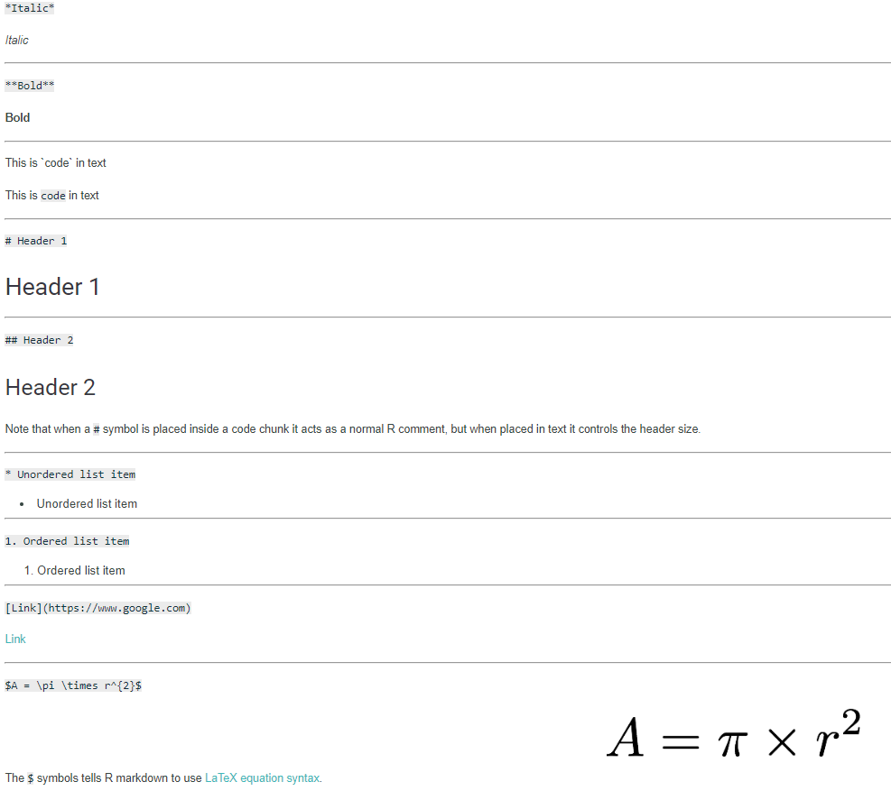
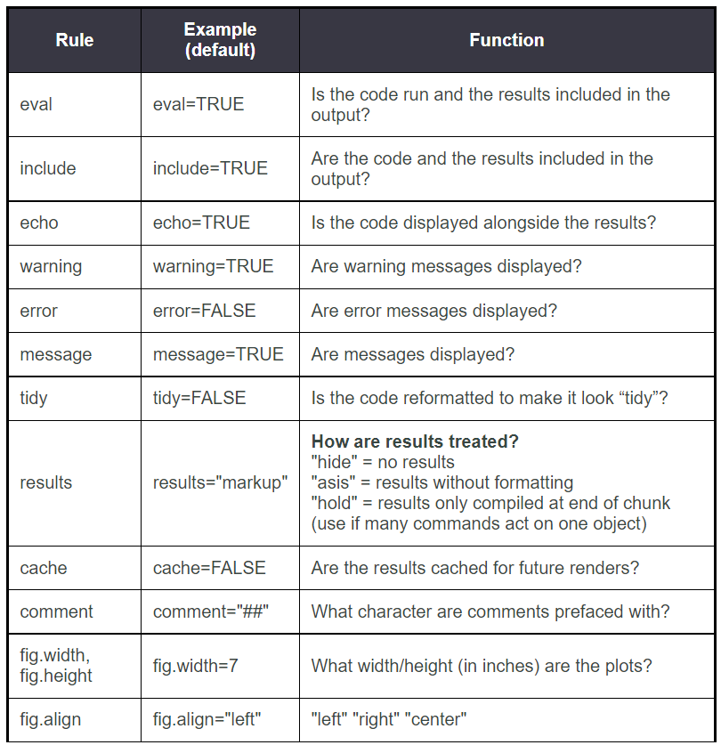

[Coding club tutorial link](https://ourcodingclub.github.io/tutorials/rmarkdown/) 


# Intro

*	Create documents that serve as a neat record of your analysis.
*	Useful for making reproducible research 
*	RMarkdown presents your code alongside its output (graphs, tables, etc.) with conventional text to explain it, a bit like a notebook.
*	RMarkdown makes use of Markdown syntax. Markdown is a very simple ‘markup’ language which provides methods for creating documents with headers, images, links etc. from plain text files, while keeping the original plain text file easy to read. 
*	You can convert Markdown documents to many other file types like .html or .pdf to display the headers, images etc..
*	When you create an RMarkdown file (.Rmd), you use conventional Markdown syntax alongside chunks of code written in R
*	When you knit the RMarkdown file, the Markdown formatting and the R code are evaluated, and an output file (HTML, PDF, etc) is produced.
<br> 
<br>
*	Have to install RMarkdown using install.packages("rmarkdown"), then load it with library(rmarkdown)
<br> 
<br>
*	To create new RMarkdown file (.Rmd), in RStudio, go to File – New File – R Markdown
*	Choose file type you want e.g. .html
*	Can give title, but this doesn't save the file to your documents – you still have to save it once it's been created 
*	Newly created file comes with basic instructions, but can delete all (or create empty document to start with)
<br> 
<br>
*	The YAML header
    * At the top of any RMarkdown script is a YAML header section enclosed by ---. By default this includes a title, author, date and the file type you want to output to (This is the minimum you should put in your header section). 
    * Rules in the header section will alter the whole document

* Once added header, can test the file by compiling it to .html
    *	Do this by pressing the Knit button
    * If you want the output to be displayed in the Viewer window in RStudio select “View in Pane” from the drop down menu that appears when you click on the  Settings gear icon drop down menu next to the Knit button.
    * A html file will be saved to the same folder where your .Rmd file is saved 

<br> 
<br>
Here are some examples of markdown syntax:

*Italic*

**Bold**

This is `code` in text

# Header 1

## Header 2

* Unordered list item

1. Ordered list item

[Google website link](https://www.google.com) 

$A = \pi \times r^{2}$

<br> 
<br>
And here they are attached as an image:



<br> 
<br>

# Code chunks
Code that is included in your .Rmd document should be enclosed by three backwards apostrophes ``` (grave accents!). These are known as code chunks.

You can quickly insert a code chunk in RStudio using a button in the toolbar - click the insert button.

```{r}
norm <- rnorm(100, mean = 0, sd = 1)
```

<br>
<br>

```{r}
A <- c("a", "a", "b", "b")
B <- c(5, 10, 15, 20)
dataframe <- data.frame(A, B)
print(dataframe)
```
<br>
<br>
If loading dataframe from a .csv file, you must include the code in the .Rmd file
```{r}
# dataframe <- read.csv("~/Desktop/Code/dataframe.csv")
```

<br>
<br>
If using packages, you have to load them 
```{r}
library(dplyr)
```

<br>
<br>
Hiding code chunks

If you don’t want the code of a particular code chunk to appear in the final document, but still want to show the output (e.g. a plot), then you can include echo = FALSE in the code chunk instructions.
```{r, echo = FALSE}
A <- c("a", "a", "b", "b")
B <- c(5, 10, 15, 20)
dataframe <- data.frame(A, B)
print(dataframe)
```

<br>
<br>
Similarly, you might want to create an object, but not include **both** the code and the output in the final .html file. To do this you can use, include = FALSE.
```{r, include = FALSE}
# richness <-
#   edidiv %>%
#     group_by(taxonGroup) %>%
#     summarise(Species_richness = n_distinct(taxonName))
```

<br>
<br>
In some cases, when you load packages into RStudio, various warning messages such as “Warning: package ‘dplyr’ was built under R version 3.4.4” might appear. If you do not want these warning messages to appear, you can use warning = FALSE.
```{r, warning = FALSE}
library(dplyr)
```

<br>
<br>

### More code chunk instructions


<br>
<br>

# Inserting Figures
By default, RMarkdown will place graphs by maximising their height, while keeping them within the margins of the page and maintaining aspect ratio. If you have a particularly tall figure, this can mean a really huge graph. In the following example we modify the dimensions of the figure we created above. To manually set the figure dimensions, you can insert an instruction into the curly braces:
```{r, fig.width = 4, fig.height = 3}
A <- c("a", "a", "b", "b")
B <- c(5, 10, 15, 20)
dataframe <- data.frame(A, B)
print(dataframe)
boxplot(B~A,data=dataframe)
```

<br>
<br>

# Inserting tables

### kable() function from knitr package
The most aesthetically pleasing and simple table formatting function I have found is kable() in the knitr package. The first argument tells kable to make a table out of the object dataframe and that numbers should have two significant figures
```{r}
library(knitr)
kable(dataframe, digits = 2)
```

<br>
<br>

### pander function from pander package
If you want a bit more control over the content of your table you can use pander() in the pander package. Imagine I want the 3rd column to appear in italics:
```{r}
library(pander)
plant <- c("a", "b", "c")
temperature <- c(20, 20, 20)
growth <- c(0.65, 0.95, 0.15)
dataframe <- data.frame(plant, temperature, growth)
emphasize.italics.cols(3)   # Make the 3rd column italics
pander(dataframe)           # Create the table
```

<br>
<br>

### Manually creating tables using markdown syntax
Should be put outside code chunks

| Plant | Temp. | Growth |
|:------|:-----:|-------:|
| A     | 20    | 0.65   |
| B     | 20    | 0.95   |
| C     | 20    | 0.15   |

The :-----: tells markdown that the line above should be treated as a header and the lines below should be treated as the body of the table. 

Text alignment of the columns is set by the position of :

:----: Centre

:----- Left

-----: Right


<br>
<br>

### Creating tables from model outputs

Using tidy() from the package broom, we are able to create tables of our model outputs, and insert these tables into our markdown file. The example below shows a simple example linear model, where the summary output table can be saved as a new R object and then added into the markdown file

```{r warning=FALSE}
library(broom)
library(pander)
A <- c(20, 15, 10)
B <- c(1, 2, 3)

lm_test <- lm(A ~ B)            # Creating linear model

table_obj <- tidy(lm_test)      # Using tidy() to create a new R object called table

pander(table_obj, digits = 3)   # Using pander() to view the created table, with 3 sig figs 
```

By using warning=FALSE as an argument, any warnings produced will be outputted in the console when knitting but will not appear in the produced document.

<br>
<br>

# Creating .pdf files in Rmarkdown

Uses LaTeX to do this. 

Install the TinyTex distribution to use LaTeX.
```{r}
# install.packages("tinytex")
# tinytex::install_tinytex()
```
<br>
<br>
To compile a .pdf, chose knit to pdf from the dropdown menu 

<br>
<br>

### Common issues with compiling to pdf 

* If text is running off the page, add this code chunk below your YAML header (code won't be displayed due to the include=FALSE). tidy.opts = list(width.cutoff = 60) defines the margin cutoff point and wraps text to the next line. Play with the value to get it right.

```{r global_options, include = FALSE}
knitr::opts_chunk$set(message=FALSE,
tidy.opts=list(width.cutoff=60))
```

* Lose syntex highlighting - use xelatex to compile your .pdf (by default, R uses base LaTeX engine). Will have to specify in YAML header
* Page margins too big or small - add geometry argument to YAML header
* Plot/table/code split over 2 pages - add page break before the dodgy element (\pagebreak)
* Change font - add font argument to YAML header e.g. mainfont: Arial

<br>
<br>
R notebooks may replace R Markdown in future. 

<br>
<br>


